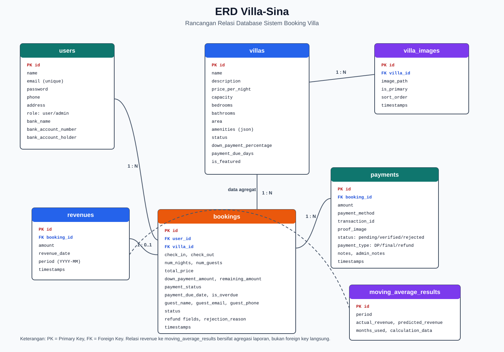
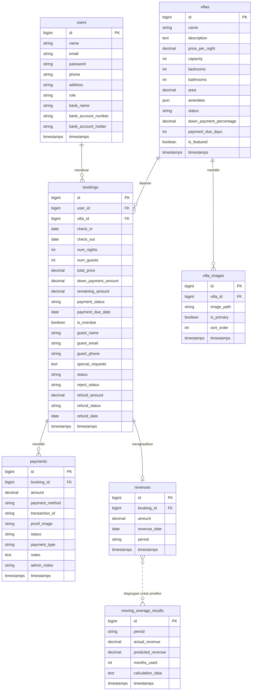

# ERD dan Rancangan Relasi Database Villa-Sina

## 1. Gambaran Umum

Database Villa-Sina dirancang untuk mendukung proses booking villa, pembayaran DP/pelunasan/refund, pengelolaan katalog villa, penyimpanan gambar villa, laporan pendapatan, dan prediksi pendapatan menggunakan moving average.

Entitas utama pada sistem ini adalah `users`, `villas`, `villa_images`, `bookings`, `payments`, `revenues`, dan `moving_average_results`.

## 2. Diagram ERD

Versi Mermaid:

## 3. Daftar Entitas

### 3.1 Tabel `users`

Tabel `users` menyimpan data akun pengguna, baik pelanggan maupun admin.

| Field | Tipe | Key | Keterangan |
| --- | --- | --- | --- |
| id | bigint | PK | ID user. |
| name | string | - | Nama pengguna. |
| email | string | unique | Email untuk login. |
| email_verified_at | timestamp nullable | - | Waktu verifikasi email. |
| password | string | - | Password terenkripsi. |
| phone | string nullable | - | Nomor telepon. |
| address | string nullable | - | Alamat pengguna. |
| role | enum user/admin | - | Hak akses pengguna. |
| bank_name | string nullable | - | Nama bank admin untuk pembayaran. |
| bank_account_number | string nullable | - | Nomor rekening admin. |
| bank_account_holder | string nullable | - | Nama pemilik rekening admin. |
| remember_token | string nullable | - | Token session remember me. |
| created_at, updated_at | timestamp | - | Waktu pembuatan dan perubahan data. |

Relasi:

| Relasi | Kardinalitas | Keterangan |
| --- | --- | --- |
| users ke bookings | 1:N | Satu user dapat membuat banyak booking. |

### 3.2 Tabel `villas`

Tabel `villas` menyimpan data villa yang ditampilkan di katalog dan dikelola admin.

| Field | Tipe | Key | Keterangan |
| --- | --- | --- | --- |
| id | bigint | PK | ID villa. |
| name | string | - | Nama villa. |
| description | text | - | Deskripsi villa. |
| price_per_night | decimal(15,2) | - | Harga per malam. |
| capacity | integer | - | Kapasitas maksimal tamu. |
| bedrooms | integer | - | Jumlah kamar tidur. |
| bathrooms | integer | - | Jumlah kamar mandi. |
| area | decimal(10,2) nullable | - | Luas villa. |
| amenities | json nullable | - | Fasilitas villa. |
| status | enum available/unavailable/maintenance | - | Status ketersediaan villa. |
| down_payment_percentage | decimal(5,2) | - | Persentase DP. |
| payment_due_days | integer | - | Batas pembayaran berdasarkan hari sebelum check-in. |
| is_featured | boolean | - | Penanda villa unggulan. |
| created_at, updated_at | timestamp | - | Waktu pembuatan dan perubahan data. |

Relasi:

| Relasi | Kardinalitas | Keterangan |
| --- | --- | --- |
| villas ke villa_images | 1:N | Satu villa dapat memiliki banyak gambar. |
| villas ke bookings | 1:N | Satu villa dapat memiliki banyak booking pada tanggal berbeda. |

### 3.3 Tabel `villa_images`

Tabel `villa_images` menyimpan foto-foto villa.

| Field | Tipe | Key | Keterangan |
| --- | --- | --- | --- |
| id | bigint | PK | ID gambar. |
| villa_id | bigint | FK | Mengacu ke `villas.id`. |
| image_path | string | - | Lokasi file gambar. |
| is_primary | boolean | - | Penanda gambar utama. |
| sort_order | integer | - | Urutan tampilan gambar. |
| created_at, updated_at | timestamp | - | Waktu pembuatan dan perubahan data. |

Aturan:

| Aturan | Keterangan |
| --- | --- |
| Delete cascade | Jika villa dihapus, gambar villa ikut terhapus dari database. |
| Gambar utama | Satu villa sebaiknya memiliki satu gambar dengan `is_primary = true`. |

### 3.4 Tabel `bookings`

Tabel `bookings` menyimpan transaksi pemesanan villa oleh user.

| Field | Tipe | Key | Keterangan |
| --- | --- | --- | --- |
| id | bigint | PK | ID booking. |
| user_id | bigint | FK | Mengacu ke `users.id`. |
| villa_id | bigint | FK | Mengacu ke `villas.id`. |
| check_in | date | - | Tanggal check-in. |
| check_out | date | - | Tanggal check-out. |
| num_nights | integer | - | Jumlah malam menginap. |
| num_guests | integer | - | Jumlah tamu. |
| total_price | decimal(15,2) | - | Total biaya booking. |
| down_payment_amount | decimal(15,2) nullable | - | Nominal DP. |
| remaining_amount | decimal(15,2) nullable | - | Sisa pembayaran. |
| payment_status | enum none/dp_paid/fully_paid/refunded | - | Status pembayaran booking. |
| payment_due_date | date nullable | - | Batas pembayaran. |
| is_overdue | boolean | - | Penanda keterlambatan pembayaran. |
| reject_status | enum none/rejected/partial_refund/full_refund | - | Status penolakan/refund. |
| rejection_reason | text nullable | - | Alasan penolakan pembayaran. |
| refund_amount | decimal(15,2) nullable | - | Nominal refund. |
| refund_status | enum none/pending/completed | - | Status proses refund. |
| refund_date | date nullable | - | Tanggal refund selesai. |
| payment_proof_image | string nullable | - | Bukti pembayaran lama/kompatibilitas. |
| guest_name | string | - | Nama tamu. |
| guest_email | string | - | Email tamu. |
| guest_phone | string | - | Nomor telepon tamu. |
| special_requests | text nullable | - | Permintaan khusus. |
| status | enum pending/confirmed/completed/cancelled | - | Status booking. |
| created_at, updated_at | timestamp | - | Waktu pembuatan dan perubahan data. |

Relasi:

| Relasi | Kardinalitas | Keterangan |
| --- | --- | --- |
| bookings ke users | N:1 | Banyak booking dimiliki satu user. |
| bookings ke villas | N:1 | Banyak booking dapat terkait satu villa. |
| bookings ke payments | 1:N | Satu booking dapat memiliki DP, pelunasan, dan refund. |
| bookings ke revenues | 1:0..1 | Satu booking valid dapat menghasilkan satu data revenue. |

### 3.5 Tabel `payments`

Tabel `payments` menyimpan semua aktivitas pembayaran, termasuk DP, pelunasan, dan refund.

| Field | Tipe | Key | Keterangan |
| --- | --- | --- | --- |
| id | bigint | PK | ID payment. |
| booking_id | bigint | FK | Mengacu ke `bookings.id`. |
| amount | decimal(15,2) | - | Nominal pembayaran. Nilai refund dapat disimpan negatif. |
| payment_method | string | - | Metode pembayaran, misalnya transfer bank atau e-wallet. |
| transaction_id | string nullable | - | Nomor transaksi/referensi transfer. |
| proof_image | string nullable | - | Lokasi file bukti pembayaran. |
| status | enum pending/verified/rejected | - | Status verifikasi payment. |
| payment_type | enum down_payment/final_payment/refund | - | Jenis payment. |
| notes | text nullable | - | Catatan user. |
| admin_notes | string nullable | - | Catatan admin saat verifikasi atau penolakan. |
| created_at, updated_at | timestamp | - | Waktu pembuatan dan perubahan data. |

Aturan:

| Aturan | Keterangan |
| --- | --- |
| DP sebelum pelunasan | Pelunasan booking cicilan hanya dapat diproses setelah DP terverifikasi. |
| Verifikasi admin | Payment baru masuk sebagai pending dan berubah menjadi verified/rejected oleh admin. |
| Upload bukti | Bukti pembayaran disimpan di storage public. |

### 3.6 Tabel `revenues`

Tabel `revenues` menyimpan pendapatan dari booking yang valid untuk kebutuhan dashboard dan laporan.

| Field | Tipe | Key | Keterangan |
| --- | --- | --- | --- |
| id | bigint | PK | ID revenue. |
| booking_id | bigint | FK | Mengacu ke `bookings.id`. |
| amount | decimal(15,2) | - | Nominal pendapatan. |
| revenue_date | date | - | Tanggal pendapatan dicatat. |
| period | string | - | Periode pendapatan, biasanya format YYYY-MM. |
| created_at, updated_at | timestamp | - | Waktu pembuatan dan perubahan data. |

Relasi:

| Relasi | Kardinalitas | Keterangan |
| --- | --- | --- |
| revenues ke bookings | N:1 atau 1:1 konseptual | Setiap revenue berasal dari booking tertentu. Secara model aplikasi digunakan sebagai satu revenue per booking. |

### 3.7 Tabel `moving_average_results`

Tabel `moving_average_results` menyimpan hasil prediksi pendapatan dengan metode moving average.

| Field | Tipe | Key | Keterangan |
| --- | --- | --- | --- |
| id | bigint | PK | ID hasil prediksi. |
| period | string | - | Periode prediksi. |
| actual_revenue | decimal(15,2) | - | Pendapatan aktual periode tersebut. |
| predicted_revenue | decimal(15,2) | - | Hasil prediksi pendapatan. |
| months_used | integer | - | Jumlah bulan yang digunakan dalam perhitungan. |
| calculation_data | text/json | - | Detail data perhitungan. |
| created_at, updated_at | timestamp | - | Waktu pembuatan dan perubahan data. |

Catatan: tabel ini tidak memiliki foreign key langsung ke `revenues`, tetapi datanya dihitung dari agregasi pendapatan per periode.

## 4. Rancangan Kardinalitas

| No | Relasi | Kardinalitas | Implementasi Database | Keterangan |
| --- | --- | --- | --- | --- |
| 1 | User - Booking | 1:N | `bookings.user_id` ke `users.id` | Satu user dapat membuat banyak booking. |
| 2 | Villa - Booking | 1:N | `bookings.villa_id` ke `villas.id` | Satu villa dapat dipesan berkali-kali selama tanggal tidak bentrok. |
| 3 | Villa - Villa Image | 1:N | `villa_images.villa_id` ke `villas.id` | Satu villa memiliki banyak gambar. |
| 4 | Booking - Payment | 1:N | `payments.booking_id` ke `bookings.id` | Satu booking dapat memiliki DP, pelunasan, dan refund. |
| 5 | Booking - Revenue | 1:0..1 | `revenues.booking_id` ke `bookings.id` | Booking yang valid dapat dicatat sebagai pendapatan. |
| 6 | Revenue - Moving Average Result | Agregasi | Tidak ada FK langsung | Data revenue dikelompokkan per periode untuk prediksi. |

## 5. Rancangan Aturan Relasi

| Aturan | Penjelasan |
| --- | --- |
| User dihapus | Booking milik user ikut terhapus karena foreign key menggunakan cascade. |
| Villa dihapus | Booking dan gambar terkait ikut terhapus secara database, tetapi aplikasi mencegah penghapusan villa yang sudah memiliki booking. |
| Booking dihapus | Payment dan revenue terkait ikut terhapus karena cascade. |
| Gambar villa | Gambar fisik disimpan di storage, sedangkan path gambar disimpan pada `villa_images.image_path`. |
| Bukti pembayaran | File bukti disimpan di storage, sedangkan path disimpan pada `payments.proof_image`. |
| Booking aktif | Booking dengan status selain cancelled dianggap dapat memblokir tanggal villa. |
| Pembayaran lunas | Booking dianggap lunas jika `payment_status = fully_paid`. |
| Refund | Refund dicatat pada field refund di booking dan juga sebagai payment dengan `payment_type = refund`. |

## 6. Normalisasi dan Alasan Desain

| Desain | Alasan |
| --- | --- |
| Data villa dipisah dari gambar | Satu villa dapat memiliki banyak gambar tanpa menggandakan data villa. |
| Data booking dipisah dari payment | Satu booking dapat memiliki beberapa transaksi pembayaran. |
| Data revenue dipisah dari booking | Laporan pendapatan lebih mudah dihitung berdasarkan tanggal dan periode revenue. |
| Data moving average dipisah | Hasil prediksi dapat disimpan dan dibandingkan dengan pendapatan aktual. |
| Data rekening admin berada di users | Admin dapat mengelola rekening tujuan pembayaran dari profil. |

## 7. Rancangan Index dan Constraint yang Disarankan

Beberapa constraint sudah dibuat oleh Laravel melalui foreign key. Untuk pengembangan berikutnya, rancangan ini dapat ditambah:

| Rekomendasi | Tujuan |
| --- | --- |
| Index `bookings.check_in` dan `bookings.check_out` | Mempercepat pengecekan ketersediaan villa. |
| Index `bookings.status` | Mempercepat filter booking aktif/cancelled. |
| Index `bookings.payment_status` | Mempercepat pemisahan booking lunas dan belum lunas. |
| Index `revenues.period` | Mempercepat laporan pendapatan bulanan. |
| Unique gabungan `payments.transaction_id` dan `payments.payment_type` | Mencegah duplikasi nomor transaksi untuk jenis pembayaran yang sama. |
| Constraint satu primary image per villa | Menjaga agar satu villa hanya memiliki satu gambar utama. |

## 8. Ringkasan Relasi Model Laravel

| Model | Relasi | Bentuk |
| --- | --- | --- |
| `User` | `bookings()` | hasMany Booking |
| `Villa` | `bookings()` | hasMany Booking |
| `Villa` | `images()` | hasMany VillaImage |
| `Villa` | `primaryImage()` | hasOne VillaImage |
| `Booking` | `user()` | belongsTo User |
| `Booking` | `villa()` | belongsTo Villa |
| `Booking` | `payments()` | hasMany Payment |
| `Booking` | `latestPayment()` | hasOne Payment terbaru |
| `Booking` | `revenue()` | hasOne Revenue |
| `Payment` | `booking()` | belongsTo Booking |
| `Revenue` | `booking()` | belongsTo Booking |
