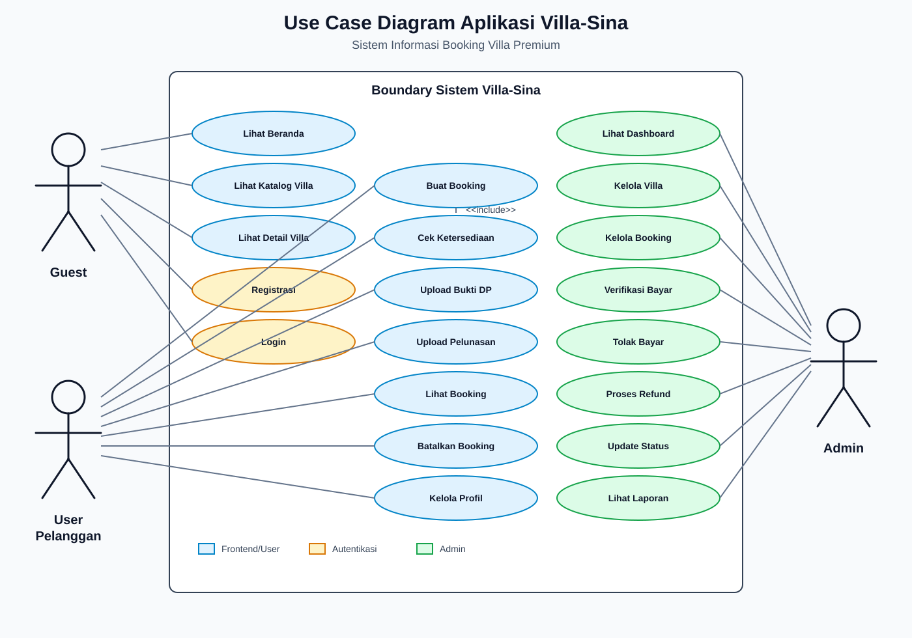
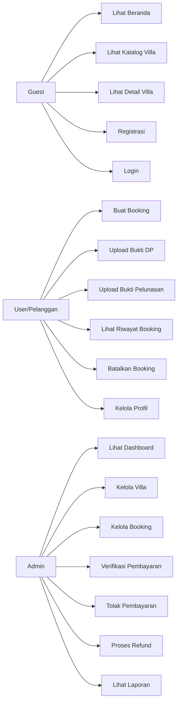
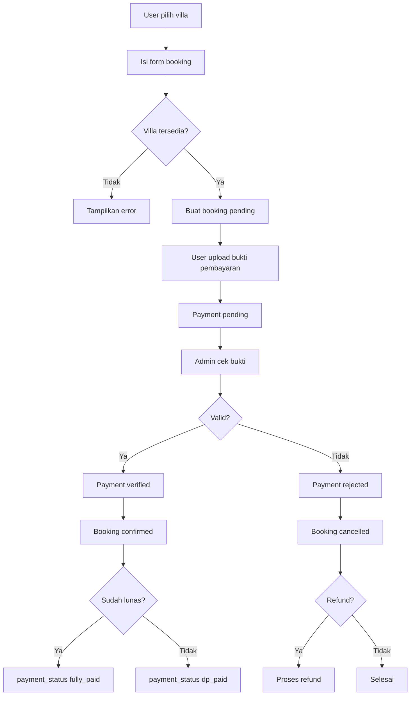
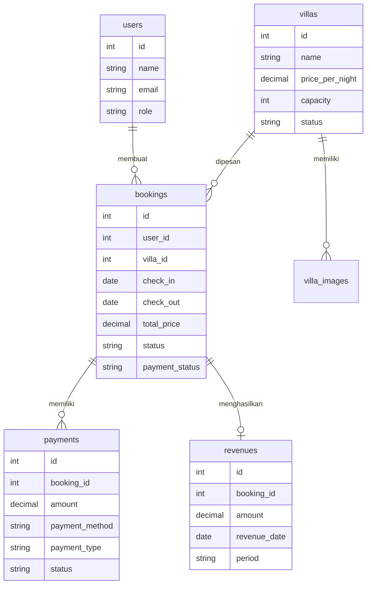

# Use Case dan Rancangan Aplikasi Villa-Sina

## 1. Gambaran Umum Sistem

Villa-Sina adalah sistem informasi booking villa berbasis web yang digunakan untuk menampilkan katalog villa, menerima pemesanan dari pelanggan, memproses pembayaran DP atau lunas, memverifikasi bukti pembayaran, mengelola data villa, serta menyajikan laporan pendapatan dengan analisis moving average.

Sistem dibangun menggunakan Laravel dengan pemisahan area frontend untuk pelanggan dan area admin untuk pengelola.

## 2. Aktor Sistem

| Aktor | Deskripsi |
| --- | --- |
| Guest | Pengunjung yang belum login. Dapat melihat halaman utama, katalog villa, detail villa, login, dan registrasi. |
| User/Pelanggan | Pengguna terdaftar yang dapat melakukan booking, upload bukti pembayaran, melihat riwayat booking, membatalkan booking pending, dan mengelola profil. |
| Admin | Pengelola sistem yang dapat mengelola villa, memantau dashboard, memverifikasi pembayaran, menolak pembayaran, memproses refund, memperbarui status booking, dan melihat laporan pendapatan. |

## 3. Use Case Utama

### 3.1 Use Case Guest

| Kode | Use Case | Tujuan | Hasil |
| --- | --- | --- | --- |
| UC-01 | Melihat Beranda | Guest melihat ringkasan aplikasi dan villa unggulan. | Daftar villa unggulan tampil. |
| UC-02 | Melihat Katalog Villa | Guest mencari villa berdasarkan nama, kapasitas, dan rentang harga. | Sistem menampilkan daftar villa tersedia. |
| UC-03 | Melihat Detail Villa | Guest melihat informasi lengkap villa, foto, harga, kapasitas, dan tanggal yang sudah dipesan. | Detail villa tampil. |
| UC-04 | Registrasi Akun | Guest membuat akun pelanggan. | Akun baru tersimpan dan dapat digunakan login. |
| UC-05 | Login | Guest masuk ke sistem. | Sistem mengarahkan user sesuai role. |

### 3.2 Use Case User/Pelanggan

| Kode | Use Case | Tujuan | Hasil |
| --- | --- | --- | --- |
| UC-06 | Membuat Booking | User memilih villa, tanggal check-in/check-out, jumlah tamu, data tamu, dan rencana pembayaran. | Booking dibuat dengan status pending. |
| UC-07 | Mengecek Ketersediaan Villa | Sistem memastikan villa tidak bentrok dengan booking lain dan status villa available. | Booking hanya dibuat jika villa tersedia. |
| UC-08 | Upload Bukti Pembayaran DP | User mengunggah bukti transfer untuk DP. | Data pembayaran berstatus pending menunggu verifikasi admin. |
| UC-09 | Upload Bukti Pelunasan | User mengunggah bukti pelunasan setelah DP terverifikasi dan periode pelunasan valid. | Pembayaran akhir menunggu verifikasi admin. |
| UC-10 | Melihat Riwayat Booking | User melihat daftar booking lunas dan belum lunas. | Riwayat booking tampil berdasarkan status pembayaran. |
| UC-11 | Melihat Detail Booking | User melihat informasi booking, tagihan, status pembayaran, dan catatan admin. | Detail booking tampil. |
| UC-12 | Membatalkan Booking | User membatalkan booking yang masih pending. | Status booking menjadi cancelled. |
| UC-13 | Mengelola Profil | User memperbarui nama, email, telepon, dan alamat. | Data profil diperbarui. |

### 3.3 Use Case Admin

| Kode | Use Case | Tujuan | Hasil |
| --- | --- | --- | --- |
| UC-14 | Melihat Dashboard | Admin melihat total villa, total booking, pendapatan, transaksi, status villa, booking terbaru, dan grafik pendapatan. | Informasi operasional tampil. |
| UC-15 | Mengelola Villa | Admin menambah, mengubah, menghapus, mengatur status, harga, kapasitas, fasilitas, dan foto villa. | Data villa terkelola. |
| UC-16 | Melihat Daftar Booking | Admin memantau booking lunas dan belum lunas dengan filter tanggal. | Daftar booking tampil. |
| UC-17 | Melihat Detail Booking | Admin melihat data user, villa, pembayaran, bukti pembayaran, dan status refund. | Detail booking tampil. |
| UC-18 | Verifikasi Pembayaran | Admin menerima pembayaran pending yang valid. | Status payment menjadi verified, booking menjadi confirmed, payment status menjadi dp_paid atau fully_paid. |
| UC-19 | Tolak Pembayaran | Admin menolak pembayaran dengan alasan dan opsi refund. | Payment rejected, booking cancelled, refund dibuat jika diperlukan. |
| UC-20 | Proses Refund | Admin menyelesaikan pengembalian dana. | Refund status menjadi completed. |
| UC-21 | Update Status Booking | Admin mengubah status booking menjadi pending, confirmed, completed, atau cancelled. | Status booking diperbarui. |
| UC-22 | Melihat Laporan | Admin melihat total pendapatan, transaksi, rata-rata transaksi, villa terlaris, dan prediksi moving average. | Laporan pendapatan tampil. |

## 4. Deskripsi Use Case Detail

### UC-06 Membuat Booking

| Elemen | Keterangan |
| --- | --- |
| Aktor | User/Pelanggan |
| Prasyarat | User sudah login dan villa berstatus available. |
| Alur Utama | User membuka detail villa, memilih menu booking, mengisi tanggal check-in dan check-out, mengisi jumlah tamu dan data tamu, memilih pembayaran DP atau lunas, lalu mengirim form. |
| Validasi | Check-in harus setelah hari ini, check-out setelah check-in, jumlah tamu tidak boleh melebihi kapasitas villa, dan tanggal tidak bentrok dengan booking lain yang belum dibatalkan. |
| Hasil | Sistem membuat booking status pending, payment_status none, total harga, DP, sisa pembayaran, dan batas pembayaran. |
| Alternatif | Jika villa tidak tersedia, sistem menampilkan pesan error dan booking tidak dibuat. |

### UC-08 Upload Bukti Pembayaran DP

| Elemen | Keterangan |
| --- | --- |
| Aktor | User/Pelanggan |
| Prasyarat | Booking milik user masih aktif dan belum completed/cancelled. |
| Alur Utama | User membuka detail booking, memilih metode pembayaran, mengisi nomor transaksi jika transfer bank, mengunggah gambar bukti pembayaran, lalu submit. |
| Validasi | File harus gambar JPG/JPEG/PNG maksimal 2 MB. Nomor transaksi wajib untuk transfer bank dan unik untuk jenis pembayaran yang sama. |
| Hasil | Payment dibuat atau diperbarui dengan status pending. |
| Alternatif | Jika pembayaran jenis tersebut sudah verified, sistem menolak upload ulang. |

### UC-09 Upload Bukti Pelunasan

| Elemen | Keterangan |
| --- | --- |
| Aktor | User/Pelanggan |
| Prasyarat | DP sudah terverifikasi untuk booking cicilan. |
| Alur Utama | User mengunggah bukti pelunasan pada periode H-7 sampai H-1 sebelum check-in. |
| Validasi | Sistem memeriksa DP sudah verified, tanggal upload berada dalam periode pelunasan, dan bukti pembayaran valid. |
| Hasil | Payment final_payment dibuat dengan status pending. |
| Alternatif | Jika belum H-7 atau lewat H-1, sistem menolak upload pelunasan. |

### UC-18 Verifikasi Pembayaran

| Elemen | Keterangan |
| --- | --- |
| Aktor | Admin |
| Prasyarat | Admin login dan terdapat pembayaran status pending. |
| Alur Utama | Admin membuka detail booking, memeriksa bukti pembayaran, memilih verifikasi, dan menambahkan catatan bila perlu. |
| Validasi | Hanya payment pending yang dapat diverifikasi. Pelunasan tidak dapat diverifikasi sebelum DP verified pada booking cicilan. |
| Hasil | Payment menjadi verified. Jika DP diverifikasi, booking menjadi confirmed dan payment_status dp_paid. Jika pelunasan diverifikasi, payment_status menjadi fully_paid. |

### UC-19 Tolak Pembayaran

| Elemen | Keterangan |
| --- | --- |
| Aktor | Admin |
| Prasyarat | Terdapat pembayaran pending yang tidak valid. |
| Alur Utama | Admin memilih tolak pembayaran, mengisi alasan, memilih jenis refund full, partial, atau none. |
| Validasi | Alasan wajib diisi. Nilai refund partial tidak boleh melebihi nilai pembayaran. |
| Hasil | Payment menjadi rejected, booking menjadi cancelled, dan data refund dibuat jika ada nominal refund. |

## 5. Skenario Use Case

### 5.1 Skenario UC-01 Melihat Beranda

| Elemen | Keterangan |
| --- | --- |
| Aktor | Guest, User, Admin |
| Tujuan | Melihat halaman awal aplikasi dan villa unggulan. |
| Precondition | Pengguna membuka aplikasi melalui browser. |
| Main Flow | 1. Pengguna mengakses halaman beranda. 2. Sistem mengambil data villa dengan status available dan is_featured. 3. Sistem menampilkan halaman beranda dan daftar villa unggulan. 4. Pengguna dapat memilih villa untuk melihat detail. |
| Alternate Flow | Jika tidak ada villa unggulan, sistem tetap menampilkan beranda tanpa daftar villa unggulan. |
| Postcondition | Pengguna berhasil melihat informasi awal aplikasi. |

### 5.2 Skenario UC-02 Melihat Katalog Villa

| Elemen | Keterangan |
| --- | --- |
| Aktor | Guest, User |
| Tujuan | Mencari dan memilih villa yang tersedia. |
| Precondition | Data villa tersedia di database. |
| Main Flow | 1. Pengguna membuka menu villa. 2. Sistem menampilkan daftar villa berstatus available. 3. Pengguna mengisi pencarian nama, kapasitas, harga minimum, atau harga maksimum. 4. Sistem memfilter data sesuai input. 5. Sistem menampilkan hasil pencarian. |
| Alternate Flow | Jika data tidak ditemukan, sistem menampilkan daftar kosong atau pesan bahwa villa tidak tersedia sesuai filter. |
| Postcondition | Pengguna mendapatkan daftar villa yang sesuai kebutuhan. |

### 5.3 Skenario UC-03 Melihat Detail Villa

| Elemen | Keterangan |
| --- | --- |
| Aktor | Guest, User |
| Tujuan | Melihat informasi lengkap villa sebelum booking. |
| Precondition | Villa yang dipilih tersedia di database. |
| Main Flow | 1. Pengguna memilih salah satu villa dari katalog. 2. Sistem mengambil data villa, gambar, harga, kapasitas, fasilitas, dan tanggal booking aktif. 3. Sistem menampilkan detail villa. 4. Pengguna dapat melanjutkan ke proses booking. |
| Alternate Flow | Jika villa tidak ditemukan, sistem menampilkan halaman error 404. |
| Postcondition | Pengguna memahami detail villa yang dipilih. |

### 5.4 Skenario UC-04 Registrasi Akun

| Elemen | Keterangan |
| --- | --- |
| Aktor | Guest |
| Tujuan | Membuat akun agar dapat melakukan booking. |
| Precondition | Guest belum login. |
| Main Flow | 1. Guest membuka halaman register. 2. Guest mengisi nama, email, password, dan data lain yang diperlukan. 3. Sistem memvalidasi input. 4. Sistem menyimpan akun baru. 5. Guest dapat login menggunakan akun tersebut. |
| Alternate Flow | Jika email sudah digunakan atau input tidak valid, sistem menampilkan pesan error. |
| Postcondition | Akun user baru berhasil dibuat. |

### 5.5 Skenario UC-05 Login

| Elemen | Keterangan |
| --- | --- |
| Aktor | Guest |
| Tujuan | Masuk ke sistem sesuai hak akses. |
| Precondition | Akun sudah terdaftar. |
| Main Flow | 1. Guest membuka halaman login. 2. Guest mengisi email dan password. 3. Sistem memvalidasi kredensial. 4. Sistem membuat session login. 5. Sistem mengarahkan user ke halaman sesuai role. |
| Alternate Flow | Jika email atau password salah, sistem menampilkan pesan gagal login. |
| Postcondition | Pengguna berhasil masuk sebagai user atau admin. |

### 5.6 Skenario UC-06 Membuat Booking

| Elemen | Keterangan |
| --- | --- |
| Aktor | User/Pelanggan |
| Tujuan | Membuat pemesanan villa. |
| Precondition | User sudah login dan villa berstatus available. |
| Main Flow | 1. User membuka detail villa. 2. User memilih tombol booking. 3. Sistem menampilkan form booking. 4. User mengisi tanggal check-in, check-out, jumlah tamu, data tamu, permintaan khusus, dan rencana pembayaran. 5. Sistem memvalidasi input. 6. Sistem mengecek ketersediaan villa pada tanggal tersebut. 7. Sistem menghitung jumlah malam, total harga, DP, sisa pembayaran, dan batas pembayaran. 8. Sistem menyimpan booking dengan status pending. 9. Sistem mengarahkan user ke detail booking. |
| Alternate Flow | Jika tanggal bentrok, jumlah tamu melebihi kapasitas, atau input tidak valid, sistem menampilkan pesan error dan booking tidak dibuat. |
| Postcondition | Booking baru tersimpan dan menunggu pembayaran. |

### 5.7 Skenario UC-08 Upload Bukti Pembayaran DP

| Elemen | Keterangan |
| --- | --- |
| Aktor | User/Pelanggan |
| Tujuan | Mengirim bukti pembayaran DP kepada admin. |
| Precondition | User sudah login, booking milik user, dan booking belum cancelled/completed. |
| Main Flow | 1. User membuka detail booking. 2. User memilih jenis pembayaran DP. 3. User memilih metode pembayaran. 4. Jika metode transfer bank, user mengisi nomor transaksi. 5. User mengunggah gambar bukti pembayaran. 6. Sistem memvalidasi metode pembayaran, nomor transaksi, dan file gambar. 7. Sistem menyimpan payment dengan status pending. 8. Sistem menampilkan pesan bahwa pembayaran menunggu verifikasi admin. |
| Alternate Flow | Jika file bukan gambar, ukuran lebih dari 2 MB, nomor transaksi duplikat, atau DP sudah verified, sistem menampilkan pesan error. |
| Postcondition | Bukti pembayaran DP tersimpan dan menunggu verifikasi. |

### 5.8 Skenario UC-09 Upload Bukti Pelunasan

| Elemen | Keterangan |
| --- | --- |
| Aktor | User/Pelanggan |
| Tujuan | Melunasi sisa pembayaran booking. |
| Precondition | User sudah login, booking milik user, DP sudah verified untuk booking cicilan, dan tanggal upload berada pada periode H-7 sampai H-1 sebelum check-in. |
| Main Flow | 1. User membuka detail booking. 2. User memilih jenis pembayaran pelunasan. 3. User memilih metode pembayaran dan mengisi data transaksi. 4. User mengunggah bukti pelunasan. 5. Sistem memvalidasi DP, periode pelunasan, metode pembayaran, nomor transaksi, dan file bukti. 6. Sistem menyimpan payment final_payment dengan status pending. 7. Sistem menampilkan pesan menunggu verifikasi admin. |
| Alternate Flow | Jika DP belum verified, belum masuk H-7, sudah lewat H-1, atau bukti tidak valid, sistem menolak upload. |
| Postcondition | Bukti pelunasan tersimpan dan menunggu verifikasi admin. |

### 5.9 Skenario UC-10 Melihat Riwayat Booking

| Elemen | Keterangan |
| --- | --- |
| Aktor | User/Pelanggan |
| Tujuan | Melihat daftar booking milik sendiri. |
| Precondition | User sudah login. |
| Main Flow | 1. User membuka menu Booking Saya. 2. Sistem mengambil booking berdasarkan user_id login. 3. Sistem memisahkan booking lunas dan belum lunas. 4. Sistem menampilkan daftar booking beserta statusnya. 5. User dapat membuka detail salah satu booking. |
| Alternate Flow | Jika user belum memiliki booking, sistem menampilkan daftar kosong. |
| Postcondition | User mengetahui status booking miliknya. |

### 5.10 Skenario UC-12 Membatalkan Booking

| Elemen | Keterangan |
| --- | --- |
| Aktor | User/Pelanggan |
| Tujuan | Membatalkan booking yang belum dikonfirmasi. |
| Precondition | User sudah login, booking milik user, dan status booking masih pending. |
| Main Flow | 1. User membuka detail booking. 2. User memilih aksi batalkan booking. 3. Sistem memeriksa kepemilikan booking dan status booking. 4. Sistem mengubah status booking menjadi cancelled. 5. Sistem menampilkan pesan berhasil. |
| Alternate Flow | Jika booking bukan milik user atau status bukan pending, sistem menolak pembatalan. |
| Postcondition | Booking berstatus cancelled. |

### 5.11 Skenario UC-13 Mengelola Profil

| Elemen | Keterangan |
| --- | --- |
| Aktor | User/Pelanggan, Admin |
| Tujuan | Memperbarui data profil. |
| Precondition | Pengguna sudah login. |
| Main Flow | 1. Pengguna membuka halaman profil. 2. Sistem menampilkan data profil saat ini. 3. Pengguna mengubah nama, email, telepon, atau alamat. 4. Jika pengguna admin, admin dapat mengubah data rekening pembayaran. 5. Sistem memvalidasi input. 6. Sistem menyimpan perubahan. |
| Alternate Flow | Jika email sudah dipakai user lain atau data rekening admin tidak lengkap, sistem menampilkan pesan error. |
| Postcondition | Data profil berhasil diperbarui. |

### 5.12 Skenario UC-14 Melihat Dashboard Admin

| Elemen | Keterangan |
| --- | --- |
| Aktor | Admin |
| Tujuan | Memantau kondisi operasional villa dan pendapatan. |
| Precondition | Admin sudah login. |
| Main Flow | 1. Admin membuka dashboard. 2. Sistem menghitung total villa, total booking, status villa, pendapatan, jumlah transaksi, dan rata-rata pendapatan. 3. Sistem mengambil booking terbaru dan villa terbaru. 4. Sistem membangun data grafik pendapatan dan prediksi moving average. 5. Sistem menampilkan dashboard admin. |
| Alternate Flow | Jika filter bulan, tahun, tanggal, atau villa dipilih, sistem menampilkan data sesuai filter. |
| Postcondition | Admin mendapatkan ringkasan kondisi bisnis. |

### 5.13 Skenario UC-15 Mengelola Villa

| Elemen | Keterangan |
| --- | --- |
| Aktor | Admin |
| Tujuan | Menambah, mengubah, atau menghapus data villa. |
| Precondition | Admin sudah login. |
| Main Flow | 1. Admin membuka menu Villas. 2. Admin memilih tambah atau edit villa. 3. Admin mengisi nama, deskripsi, harga, kapasitas, kamar, kamar mandi, luas, status, fasilitas, dan gambar. 4. Sistem memvalidasi input dan file gambar. 5. Sistem menyimpan data villa dan gambar. 6. Sistem menampilkan pesan berhasil. |
| Alternate Flow | Jika admin menghapus villa yang sudah memiliki booking, sistem menolak penghapusan. Jika file gambar tidak valid, sistem menampilkan error. |
| Postcondition | Data villa berhasil dikelola. |

### 5.14 Skenario UC-16 Melihat Daftar Booking Admin

| Elemen | Keterangan |
| --- | --- |
| Aktor | Admin |
| Tujuan | Memantau seluruh booking pelanggan. |
| Precondition | Admin sudah login. |
| Main Flow | 1. Admin membuka menu Bookings. 2. Sistem mengambil data booking beserta user, villa, dan payment terbaru. 3. Sistem memisahkan booking lunas dan belum lunas. 4. Sistem menampilkan daftar booking. 5. Admin dapat memilih detail booking. |
| Alternate Flow | Jika admin mengisi filter tanggal approved, sistem menampilkan booking lunas sesuai rentang tanggal. |
| Postcondition | Admin mengetahui status seluruh booking. |

### 5.15 Skenario UC-18 Verifikasi Pembayaran

| Elemen | Keterangan |
| --- | --- |
| Aktor | Admin |
| Tujuan | Menyetujui pembayaran yang valid. |
| Precondition | Admin sudah login dan terdapat payment status pending. |
| Main Flow | 1. Admin membuka detail booking. 2. Admin memeriksa bukti pembayaran. 3. Admin memilih tombol verifikasi pada payment pending. 4. Admin mengisi catatan jika diperlukan. 5. Sistem memvalidasi payment masih pending. 6. Sistem mengubah payment menjadi verified. 7. Sistem memperbarui status booking dan payment_status. |
| Alternate Flow | Jika payment bukan pending atau pelunasan diverifikasi sebelum DP, sistem menampilkan error. |
| Postcondition | Pembayaran valid tercatat dan status booking diperbarui. |

### 5.16 Skenario UC-19 Tolak Pembayaran

| Elemen | Keterangan |
| --- | --- |
| Aktor | Admin |
| Tujuan | Menolak pembayaran yang tidak valid. |
| Precondition | Admin sudah login dan terdapat payment status pending. |
| Main Flow | 1. Admin membuka detail booking. 2. Admin memeriksa bukti pembayaran. 3. Admin memilih tolak pembayaran. 4. Admin mengisi alasan penolakan dan memilih jenis refund. 5. Sistem memvalidasi data penolakan. 6. Sistem mengubah payment menjadi rejected. 7. Sistem mengubah booking menjadi cancelled. 8. Jika refund dipilih, sistem membuat data payment refund. |
| Alternate Flow | Jika alasan kosong atau nominal refund partial lebih besar dari pembayaran, sistem menampilkan error. |
| Postcondition | Pembayaran ditolak dan booking dibatalkan. |

### 5.17 Skenario UC-20 Proses Refund

| Elemen | Keterangan |
| --- | --- |
| Aktor | Admin |
| Tujuan | Menyelesaikan pengembalian dana kepada pelanggan. |
| Precondition | Booking memiliki refund_status pending. |
| Main Flow | 1. Admin membuka detail booking yang memiliki refund pending. 2. Admin memproses refund sesuai nominal. 3. Admin mengisi catatan jika diperlukan. 4. Sistem mengubah payment refund menjadi verified. 5. Sistem mengubah refund_status menjadi completed dan mengisi refund_date. |
| Alternate Flow | Jika tidak ada refund pending, sistem menampilkan pesan error. |
| Postcondition | Refund selesai diproses. |

### 5.18 Skenario UC-21 Update Status Booking

| Elemen | Keterangan |
| --- | --- |
| Aktor | Admin |
| Tujuan | Mengubah status booking secara manual. |
| Precondition | Admin sudah login dan booking tersedia. |
| Main Flow | 1. Admin membuka detail booking. 2. Admin memilih status baru. 3. Sistem memvalidasi status harus pending, confirmed, completed, atau cancelled. 4. Sistem menyimpan status baru. 5. Sistem menampilkan pesan berhasil. |
| Alternate Flow | Jika status tidak valid, sistem menampilkan error. |
| Postcondition | Status booking berhasil diperbarui. |

### 5.19 Skenario UC-22 Melihat Laporan

| Elemen | Keterangan |
| --- | --- |
| Aktor | Admin |
| Tujuan | Melihat performa pendapatan dan villa terlaris. |
| Precondition | Admin sudah login. |
| Main Flow | 1. Admin membuka menu Reports. 2. Sistem mengambil data revenue berdasarkan periode. 3. Sistem menghitung total pendapatan, total transaksi, rata-rata transaksi, dan top villa. 4. Sistem mengambil data prediksi moving average. 5. Sistem menampilkan laporan kepada admin. |
| Alternate Flow | Jika belum ada revenue, sistem menampilkan nilai 0 dan grafik kosong. |
| Postcondition | Admin mendapatkan laporan performa bisnis. |

## 6. Rancangan Proses Bisnis

### 6.1 Alur Booking Villa

1. Guest membuka katalog villa.
2. Guest memilih villa dan melihat detail villa.
3. Jika ingin booking, guest login atau registrasi.
4. User mengisi form booking.
5. Sistem menghitung jumlah malam, total harga, DP, sisa pembayaran, dan batas pembayaran.
6. Sistem mengecek ketersediaan villa.
7. Booking berhasil dibuat dengan status pending.
8. User mengunggah bukti pembayaran.
9. Admin memverifikasi pembayaran.
10. Jika valid, booking menjadi confirmed.
11. Jika pembayaran lunas, payment_status menjadi fully_paid.
12. Setelah masa menginap selesai, admin dapat mengubah status booking menjadi completed.

### 6.2 Alur Pembayaran

1. User memilih metode pembayaran.
2. User mengunggah bukti pembayaran.
3. Payment tersimpan dengan status pending.
4. Admin memeriksa bukti pembayaran.
5. Jika valid, admin verifikasi payment.
6. Jika tidak valid, admin tolak payment dan menentukan refund.
7. Jika refund diperlukan, admin memproses pengembalian dana sampai completed.

### 6.3 Alur Manajemen Villa

1. Admin membuka menu villa.
2. Admin menambah atau mengubah data villa.
3. Admin mengisi nama, deskripsi, harga per malam, kapasitas, kamar, kamar mandi, luas, fasilitas, status, dan foto.
4. Sistem menyimpan data villa dan gambar.
5. Villa tampil di frontend jika status available.

### 6.4 Alur Laporan Pendapatan

1. Sistem menyimpan revenue dari transaksi yang sudah valid.
2. Admin membuka dashboard atau laporan.
3. Sistem menampilkan total pendapatan, jumlah transaksi, rata-rata transaksi, grafik pendapatan bulanan, villa terlaris, dan prediksi moving average.
4. Admin dapat menggunakan informasi tersebut untuk evaluasi bisnis.

## 7. Rancangan Arsitektur Aplikasi

| Layer | Komponen | Tanggung Jawab |
| --- | --- | --- |
| Presentation | Blade View, Tailwind CSS, Chart.js | Menampilkan UI frontend, admin, form, tabel, dan grafik. |
| Routing | routes/web.php | Mendefinisikan URL publik, user, auth, dan admin. |
| Controller | Frontend dan Admin Controller | Mengelola request, validasi, proses bisnis, dan pemilihan view. |
| Model | User, Villa, VillaImage, Booking, Payment, Revenue, MovingAverageResult | Representasi data dan relasi database. |
| Storage | Laravel public disk | Menyimpan gambar villa dan bukti pembayaran. |
| Database | MySQL atau SQLite | Menyimpan data user, villa, booking, payment, revenue, dan hasil moving average. |

## 8. Rancangan Modul

| Modul | Fitur |
| --- | --- |
| Autentikasi | Login, registrasi, logout, proteksi route user dan admin. |
| Katalog Villa | Beranda, daftar villa, pencarian, filter kapasitas, filter harga, detail villa. |
| Booking | Buat booking, hitung total harga, cek ketersediaan, riwayat booking, detail booking, pembatalan. |
| Pembayaran | Upload bukti DP, upload bukti pelunasan, validasi metode pembayaran, status pembayaran. |
| Admin Villa | CRUD villa, upload gambar, pilih gambar utama, status available/unavailable/maintenance. |
| Admin Booking | Daftar booking, detail booking, verifikasi payment, tolak payment, refund, update status. |
| Dashboard | Statistik villa, booking, pendapatan, status villa, booking terbaru, grafik pendapatan. |
| Laporan | Total revenue, transaksi, rata-rata transaksi, top villa, prediksi moving average. |
| Profil | Update data user, update rekening admin untuk instruksi pembayaran. |

## 9. Rancangan Basis Data

Dokumentasi ERD lengkap tersedia pada [ERD_RANCANGAN_DATABASE.md](ERD_RANCANGAN_DATABASE.md), termasuk gambar relasi database, kardinalitas, atribut tabel, dan aturan relasi.

### 9.1 Entitas Utama

| Entitas | Atribut Penting |
| --- | --- |
| users | id, name, email, password, phone, address, bank_name, bank_account_number, bank_account_holder, role |
| villas | id, name, description, price_per_night, capacity, bedrooms, bathrooms, area, status, is_featured, amenities, down_payment_percentage, payment_due_days |
| villa_images | id, villa_id, image_path, is_primary, sort_order |
| bookings | id, user_id, villa_id, check_in, check_out, num_nights, num_guests, total_price, down_payment_amount, remaining_amount, payment_status, payment_due_date, guest_name, guest_email, guest_phone, special_requests, status, refund fields |
| payments | id, booking_id, amount, payment_method, transaction_id, proof_image, status, payment_type, notes, admin_notes |
| revenues | id, booking_id, amount, revenue_date, period |
| moving_average_results | id, period, actual_revenue, predicted_revenue, months_used, calculation_data |

### 9.2 Relasi Data

| Relasi | Keterangan |
| --- | --- |
| User 1..n Booking | Satu user dapat memiliki banyak booking. |
| Villa 1..n Booking | Satu villa dapat dipesan berkali-kali pada tanggal berbeda. |
| Villa 1..n VillaImage | Satu villa dapat memiliki banyak gambar. |
| Booking 1..n Payment | Satu booking dapat memiliki pembayaran DP, pelunasan, atau refund. |
| Booking 1..1 Revenue | Booking valid dapat menghasilkan satu data pendapatan. |

## 10. Rancangan Status

### 10.1 Status Villa

| Status | Arti |
| --- | --- |
| available | Villa tersedia dan dapat dipesan. |
| unavailable | Villa tidak tersedia untuk dipesan. |
| maintenance | Villa sedang perawatan. |

### 10.2 Status Booking

| Status | Arti |
| --- | --- |
| pending | Booking dibuat tetapi belum dikonfirmasi. |
| confirmed | Booking dikonfirmasi setelah pembayaran valid. |
| completed | Booking selesai. |
| cancelled | Booking dibatalkan. |

### 10.3 Status Pembayaran Booking

| Status | Arti |
| --- | --- |
| none | Belum ada pembayaran verified. |
| dp_paid | DP sudah terverifikasi. |
| fully_paid | Pembayaran sudah lunas. |

### 10.4 Status Payment

| Status | Arti |
| --- | --- |
| pending | Bukti pembayaran menunggu verifikasi admin. |
| verified | Pembayaran diterima dan valid. |
| rejected | Pembayaran ditolak. |

## 11. Rancangan Hak Akses

| Fitur | Guest | User | Admin |
| --- | --- | --- | --- |
| Lihat beranda | Ya | Ya | Ya |
| Lihat katalog dan detail villa | Ya | Ya | Ya |
| Registrasi dan login | Ya | Tidak perlu | Tidak perlu |
| Membuat booking | Tidak | Ya | Ya, jika menggunakan akses user |
| Upload pembayaran | Tidak | Ya, milik sendiri | Tidak dari frontend |
| Lihat booking sendiri | Tidak | Ya | Tidak |
| Kelola villa | Tidak | Tidak | Ya |
| Kelola booking semua user | Tidak | Tidak | Ya |
| Verifikasi pembayaran | Tidak | Tidak | Ya |
| Proses refund | Tidak | Tidak | Ya |
| Lihat dashboard dan laporan | Tidak | Tidak | Ya |

## 12. Rancangan Menu

### Frontend

| Menu | Isi |
| --- | --- |
| Beranda | Villa unggulan dan akses ke katalog. |
| Villa | Daftar villa, pencarian, filter, dan detail. |
| Booking Saya | Riwayat booking user. |
| Profil | Data profil user. |
| Login/Register | Autentikasi user. |

### Admin

| Menu | Isi |
| --- | --- |
| Dashboard | Statistik, filter pendapatan, grafik, prediksi. |
| Villas | CRUD data villa dan gambar. |
| Bookings | Monitoring booking, verifikasi payment, refund, update status. |
| Reports | Laporan pendapatan, transaksi, rata-rata, villa teratas, prediksi. |
| Profile | Data admin dan rekening tujuan pembayaran. |

## 13. Rancangan Non-Fungsional

| Aspek | Rancangan |
| --- | --- |
| Keamanan | Route booking dan profil dilindungi middleware auth, route admin dilindungi middleware auth dan admin. |
| Validasi | Input tanggal, jumlah tamu, harga, file gambar, bukti pembayaran, dan status divalidasi di controller. |
| Penyimpanan File | Gambar villa dan bukti pembayaran disimpan di disk public Laravel. |
| Responsivitas | UI menggunakan Tailwind CSS agar dapat diakses di desktop dan mobile. |
| Audit Pembayaran | Payment menyimpan status, bukti pembayaran, nomor transaksi, catatan user, dan catatan admin. |
| Ketersediaan Villa | Sistem menolak booking jika tanggal bentrok dengan booking aktif. |
| Laporan | Data pendapatan diringkas per periode dan divisualisasikan dengan grafik. |

## 14. Rancangan Diagram Use Case

Berikut gambar use case diagram aplikasi Villa-Sina:

## 15. Rancangan Alur Booking dan Pembayaran

## 16. Rancangan Class/Entity Sederhana

